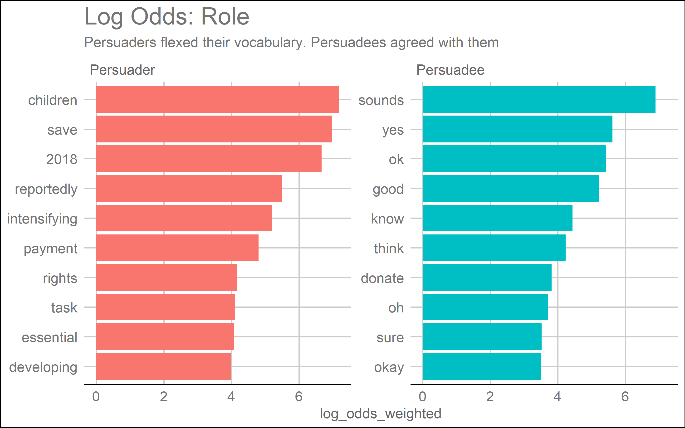

My name is Christian Okoth and I am a senior at NC State studying statistics and English. This past semester, I participated in a mentorship collaboration between the NC State statistics department and [Dr. Julia Silge](https://juliasilge.com/) from RStudio. This project used data from the paper ["Persuasion for Good"](https://doi.org/10.18653/v1/p19-1566), which includes a large set of quantitative data as well as free text. The original paper attempted to collect samples for speech to teach AIs and chatbots how to better persuade people using personalized information to target their bots more efficiently. Our approach was more to understand the participants through examining the words they said and see if there were any significant or interesting relationships between word use and group qualities.

## Debugging and reproducibility

I had not worked formally with a mentor up until this point, but working with Dr. Silge was incredible. Her mentoring style was highly interactive. Imagine a mix between live coding and dialogue back and forth, debug in real time (that was very cool, something you don't realize you need to know) and I could learn from asking questions about the process of exploring tools, options, manuals, and error messages alongside her. Exploration was a key part of learning; I had just enough guidance to point me in the right direction to solve my own problems.  

All of this is before I learned about text processing. My R journey was largely self taught, and I hadn't realized how much I was missing from my process. I generally don't like to ask questions but asking questions in this environment was empowering. Working with text data was important to me, as computer text processing needs grow every day. 

## tf-idf and repositioning

I think my favorite part of the experience is when we explored the term frequency and inverse document frequency. I had just finished making several dynamic plots of the participant variables and the frequency plots all looked very good. Then Dr. Silge brought up some information about the topic and showed me how to do some analysis with tf-idf. So I spent the week looking over it, trying to make some more plots using pieces of her code, however I could not get a lot of the plots to make much sense. The next week, we realized that it wasn't going to work. 

The combination of knowledge and ability it requires to change strategies is immense. First you have to try and fix what is wrong. Then if that doesn't work, you have to understand why it's wrong. Once you do that, you pull on knowledge from experience, knowing where to look and how to find what you need. Then you can pivot to a new strategy that will accommodate the failings of the former approach. 
For tf-idf, we tried everything: regrouping the variables, completing any incomplete lines, adjusting the code approach (percent vs. absolute). That work only returned more garbled answers. Turn to the documentation: how does the tf-idf function work in R? How does it work outside of R? What are the principal assumptions and requirements of the tf-idf approach? 

As it turns out, tf-idf wasn't broken, it was simply an inappropriate solution to our data. Rather than discerning which conversations centered around disaster relief or religion, tf-idf discerned which words were the most or least unique for any conversation, and "rupees" is pretty uncommon in the dataset. But even between thousands of conversations, search engine level tf-idf couldn't identify patterns within each group of conversations, so the issue was with the relative raw counts. Dr. Silge immediately thought to another technique she was familiar with, log-odds, frequently used in logistic regression. The specific tool was a Bayesian log-odds.  This strategy was able to accommodate the raw counts by [weighting the likelihood of finding a word in a document adjusted](https://juliasilge.github.io/tidylo/) for document size rather than a cross document unweighted comparison, and it managed to reveal some interesting relationships within the data.

## What I learned

Over the course of the semester, I learned about text processing and analysis, but I learned even more about R. There are workflows and alternative approaches, so many ways to use R that you just can't know about without a guide through it all. This experience was unique, an approach that could not be replicated as a class. Mentoring in the R community is a pillar of what brings everyone together, and I am grateful for my opportunity to participate in it.
If you would like to know more about what we did and our conclusions, you can check out the [project webpage](https://rpubs.com/cmokoth/persuasion) I created and published.
